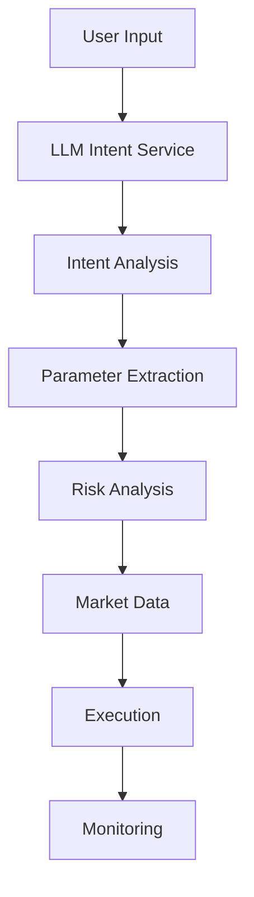

# DeFi NLP System Documentation

## Overview

The DeFi NLP System is a modern, LLM-driven platform that enables natural language interactions with DeFi protocols. It combines the power of large language models with real-time market data and risk analysis to provide a safe, efficient, and intuitive trading experience.

## Key Components

### 1. LLM Intent Service

The `LLMIntentService` uses Claude 3 Opus to understand and process natural language trading commands:

```python
from src.core.llm_intent_service import LLMIntentService

service = LLMIntentService()
intent = await service.analyze_intent(
    "Buy 100 SOL when RSI drops below 30",
    context={"risk_preference": "moderate"}
)
```

Features:
- Natural language understanding
- Context-aware processing
- Confidence scoring
- Parameter extraction
- Alternative suggestions

### 2. Risk Analysis System

The `RiskAnalyzer` provides comprehensive risk assessment:

```python
from src.core.risk_analyzer import RiskAnalyzer

analyzer = RiskAnalyzer()
assessment = await analyzer.analyze_trade_risk(
    token="SOL",
    amount=1000,
    price=100,
    market_data=market_data
)
```

Risk Factors:
- Volatility Risk
- Liquidity Risk
- Timing Risk
- Market Conditions
- Position Size Risk

### 3. Market Data Service

The `MarketDataService` provides real-time market intelligence:

```python
from src.core.market_data import MarketDataService

service = MarketDataService()
data = await service.get_token_data("SOL")
```

Features:
- Real-time price data
- Liquidity analysis
- Volume analysis
- Market correlation
- Trend detection

## Use Cases

### 1. Natural Language Trading

```python
# Simple trade
"Buy 100 SOL at market price"

# Complex conditional trade
"Buy SOL for 1000 USDC when RSI is below 30 and set stop loss at 5%"

# Multi-condition trade
"Long JTO with 2x leverage if price breaks above $2 and volume is above average"
```

### 2. Risk Management

```python
# Risk assessment
assessment = await risk_analyzer.analyze_trade_risk(...)

# Access risk factors
for factor in assessment.factors:
    print(f"{factor.name}: {factor.score:.2%}")

# Get recommendations
for rec in assessment.recommendations:
    print(f"• {rec}")
```

### 3. Market Analysis

```python
# Comprehensive analysis
"Analyze SOL market conditions and tell me if it's a good time to buy"

# Token comparison
"Compare JTO and BONK performance over the last week"
```

## Best Practices

1. **Risk Management**
   - Always include risk preferences in context
   - Monitor risk assessments for all trades
   - Pay attention to warning flags
   - Follow risk-based recommendations

2. **Market Analysis**
   - Use comprehensive market data
   - Consider multiple timeframes
   - Monitor liquidity conditions
   - Track market correlations

3. **Trade Execution**
   - Start with small trades to test
   - Use stop losses when recommended
   - Monitor execution quality
   - Follow position size recommendations

## System Architecture



## Error Handling

The system implements robust error handling:

1. **LLM Service**
   - Retry mechanism for API calls
   - Fallback intents
   - Confidence thresholds
   - Parameter validation

2. **Risk Analysis**
   - Default risk levels
   - Missing data handling
   - Warning system
   - Safety thresholds

3. **Market Data**
   - Caching system
   - Data validation
   - Fallback sources
   - Error recovery

## Performance Considerations

1. **Caching**
   - Market data cached with TTL
   - LLM responses cached when appropriate
   - Risk calculations cached with updates

2. **Parallel Processing**
   - Concurrent market data fetching
   - Parallel risk calculations
   - Async intent processing

3. **Resource Management**
   - Connection pooling
   - Rate limiting
   - Resource cleanup
   - Memory management

## Security

1. **Input Validation**
   - Natural language sanitization
   - Parameter validation
   - Context validation
   - Risk thresholds

2. **Access Control**
   - API key management
   - Rate limiting
   - Permission levels
   - Audit logging

3. **Trade Safety**
   - Position size limits
   - Risk-based restrictions
   - Slippage protection
   - MEV protection

## Monitoring and Logging

1. **System Metrics**
   - Response times
   - Error rates
   - Cache hit rates
   - Resource usage

2. **Trading Metrics**
   - Execution quality
   - Risk levels
   - Position sizes
   - P&L tracking

3. **User Metrics**
   - Intent accuracy
   - Risk preferences
   - Trading patterns
   - Error frequency

## Future Enhancements

1. **Advanced Features**
   - Portfolio optimization
   - Strategy backtesting
   - Social sentiment analysis
   - Advanced chart pattern recognition

2. **Integration**
   - Additional DEXes
   - More token support
   - Cross-chain support
   - Advanced order types

3. **AI Improvements**
   - Custom model fine-tuning
   - Improved parameter extraction
   - Better context understanding
   - Enhanced risk modeling

## Getting Started

1. **Installation**
   ```bash
   git clone <repository>
   cd defi-nlp
   pip install -r requirements.txt
   ```

2. **Configuration**
   ```python
   # Set up environment variables
   export ANTHROPIC_API_KEY=your_key
   export MARKET_DATA_API_KEY=your_key
   ```

3. **Basic Usage**
   ```python
   from src.core.llm_intent_service import LLMIntentService
   
   service = LLMIntentService()
   intent = await service.analyze_intent("Buy 100 SOL")
   ```

4. **Running Tests**
   ```bash
   pytest tests/
   ```

## Support

For issues and support:
- GitHub Issues: [Link]
- Documentation: [Link]
- Community Discord: [Link] 