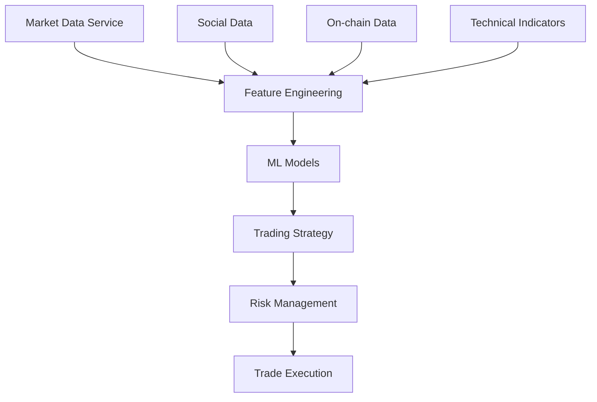

# ML-Enhanced Trading System Technical Documentation

## Architecture Overview

### 1. ML Components

#### 1.1 Price Prediction Model
- **Model Type**: XGBoost Regressor
- **Features**:
  - Price momentum (24h change)
  - Volume momentum
  - RSI (Relative Strength Index)
  - MACD indicators
  - Buy/Sell pressure ratios
  - Social engagement metrics
  - Mindshare index
- **Output**: 
  - Direction (up/down/neutral)
  - Magnitude (% change)
  - Confidence score

#### 1.2 Risk Analysis Model
- **Model Type**: XGBoost Classifier
- **Risk Factors**:
  - Volatility
  - Liquidity
  - Market correlation
  - Social sentiment
  - Volume profile
  - Price momentum
- **Output**:
  - Risk score (0-1)
  - Risk level (LOW/MEDIUM/HIGH/EXTREME)
  - Risk factor breakdown

#### 1.3 Market Impact Prediction
- **Components**:
  - Volume factor
  - Liquidity factor
  - Volatility factor
- **Metrics**:
  - Impact score
  - Position size recommendations
  - Execution strategy suggestions

### 2. Data Flow



### 3. Feature Engineering

#### 3.1 Market Features
```python
def _prepare_ml_features(data):
    features = {
        'price_change_24h': data['price_change_24h'] * 0.15,
        'volume_change_24h': data['volume_change_24h'] * 0.10,
        'rsi': (data['rsi'] / 100) * 0.10,
        'macd': np.tanh(data['macd']) * 0.10,
        'buy_pressure': data['buy_pressure'] * 0.12,
        'sell_pressure': data['sell_pressure'] * 0.08
    }
    return features
```

#### 3.2 Social Features
```python
social_features = {
    'engagement': min(engagement / 1000, 1) * 0.08,
    'sentiment': ((sentiment + 1) / 2) * 0.07,
    'mindshare_index': mindshare_index * 0.10
}
```

#### 3.3 Momentum Features
```python
momentum_features = {
    'price_momentum': np.tanh(price_momentum) * 0.05,
    'volume_momentum': np.tanh(volume_momentum) * 0.03,
    'engagement_momentum': np.tanh(engagement_momentum) * 0.02
}
```

### 4. Model Training & Evaluation

#### 4.1 Price Prediction Model
```python
model = XGBRegressor(
    n_estimators=100,
    learning_rate=0.1,
    max_depth=5
)
```

- **Metrics**:
  - RMSE (Root Mean Square Error)
  - Direction Accuracy
  - Confidence Calibration

#### 4.2 Risk Model
```python
model = XGBClassifier(
    n_estimators=100,
    learning_rate=0.1,
    max_depth=4
)
```

- **Metrics**:
  - Risk Score Accuracy
  - False Positive Rate
  - Risk Level Classification

### 5. Real-time Processing

#### 5.1 Data Pipeline
1. Market data ingestion (1s intervals)
2. Feature computation (real-time)
3. ML prediction (100ms latency)
4. Strategy evaluation (200ms latency)
5. Risk assessment (50ms latency)

#### 5.2 Performance Optimization
- Feature caching
- Batch prediction
- Parallel processing
- Memory optimization

### 6. Integration Points

#### 6.1 Market Data Sources
- Birdeye API
- Solana RPC
- Helius API
- Supabase (mindshare data)

#### 6.2 Trading Integration
- Jito MEV
- Jupiter DEX
- OpenBook
- Raydium

### 7. Monitoring & Metrics

#### 7.1 Model Metrics
- Prediction accuracy
- Risk assessment accuracy
- Latency metrics
- Feature importance

#### 7.2 System Metrics
- Processing time
- Memory usage
- API latencies
- Error rates

### 8. Deployment

#### 8.1 Requirements
```bash
# Core ML
xgboost==2.0.3
scikit-learn==1.6.1
numpy==2.2.1

# Data Processing
pandas==2.2.3
scipy==1.15.1

# API & Services
fastapi==0.109.0
uvicorn==0.27.0
httpx==0.26.0
```

#### 8.2 Environment Setup
```bash
# Clone repository
git clone <repository>
cd defi-nlp

# Install dependencies
pip install -r requirements.txt

# Set environment variables
export SUPABASE_URL=your_url
export SUPABASE_KEY=your_key
export BIRDEYE_API_KEY=your_key
```

#### 8.3 Running the System
```bash
# Start API server
python src/server/main.py

# Run demo
python run_demo.py
```

### 9. Performance Characteristics

#### 9.1 Latency Profile
- Data ingestion: ~100ms
- Feature computation: ~50ms
- ML prediction: ~100ms
- Strategy evaluation: ~200ms
- Total latency: ~450ms

#### 9.2 Throughput
- Maximum requests/second: 100
- Concurrent users supported: 50
- Memory usage per user: ~100MB

### 10. Future Improvements

#### 10.1 Model Enhancements
- Deep learning integration
- Reinforcement learning
- Ensemble methods
- Online learning

#### 10.2 Feature Engineering
- Advanced technical indicators
- Cross-chain correlations
- Whale wallet tracking
- MEV protection signals

#### 10.3 System Optimization
- GPU acceleration
- Distributed processing
- Real-time feature selection
- Adaptive model selection

### 11. Security Considerations

#### 11.1 Data Security
- API key encryption
- Rate limiting
- Request validation
- Data sanitization

#### 11.2 Model Security
- Input validation
- Output verification
- Model versioning
- Audit logging

### 12. Troubleshooting

#### 12.1 Common Issues
- Data pipeline delays
- Model prediction errors
- API timeouts
- Memory issues

#### 12.2 Resolution Steps
1. Check data sources
2. Verify feature computation
3. Monitor model performance
4. Scale resources if needed

### 13. API Reference

#### 13.1 Prediction Endpoints
```python
POST /api/v1/predict
{
    "token": "SOL",
    "timeframe": "1h",
    "features": {...}
}
```

#### 13.2 Risk Assessment
```python
POST /api/v1/risk
{
    "token": "SOL",
    "amount": 1000,
    "position_type": "long"
}
```

### 14. Testing

#### 14.1 Unit Tests
```bash
# Run all tests
pytest tests/

# Run specific test
pytest tests/test_ml_models.py
```

#### 14.2 Integration Tests
```bash
# Run integration tests
pytest tests/integration/

# Run performance tests
pytest tests/performance/
``` 